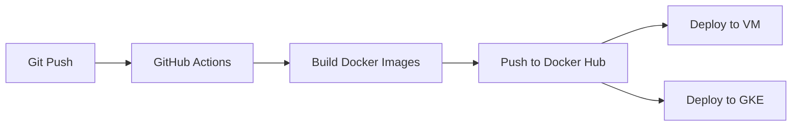

# Infraestrutura e DevOps - Conduit RealWorld

Este diretório contém toda a infraestrutura e configurações DevOps do projeto.

## 🚀 Quick Start

```bash
# 1. Configurar GCP
cd terraform/
gcloud auth login
gcloud init

# 2. Provisionar infraestrutura
terraform init
terraform apply

# 3. Configurar kubectl
gcloud container clusters get-credentials gke-conduit-frontend --region us-central1
```

## 📁 Estrutura

```
infra/
├── apis/           # Dockerfiles das APIs (Backend + Frontend)
├── gateway/        # API Gateway (Nginx)
├── kubernetes/     # Manifestos K8s (Deployments, Services, Ingress)
├── terraform/      # Infraestrutura como código (GCP)
│   ├── modules/    # Módulos Terraform
│   │   ├── compute/     # Compute Engine (VM)
│   │   ├── kubernetes/  # GKE (Kubernetes)
│   │   └── database/    # Cloud SQL (PostgreSQL)
│   └── README.md   # Guia completo
└── ansible/        # Playbooks de deploy e configuração
```

## ☁️ Infraestrutura (Google Cloud Platform)

### Recursos Provisionados

- **Compute Engine:** 1 VM e2-standard-2 (Docker + CI)
- **GKE:** Cluster Kubernetes com 1-3 nodes
- **Cloud SQL:** PostgreSQL 15 (db-f1-micro)
- **Networking:** VPC + Subnets + Firewall

### Custos Estimados

~$110/mês (você tem $300 de créditos grátis!) 💰

### Guias

- [📖 Terraform README](./terraform/README.md) - Guia completo
- [🔄 Migração Azure → GCP](./terraform/MIGRATION-AZURE-TO-GCP.md)

## 🐳 Docker

### APIs

```bash
# Build
docker build -t conduit-backend ./apis/backend
docker build -t conduit-frontend ./apis/frontend

# Run
docker-compose up -d
```

## ☸️ Kubernetes

### Deploy Manual

```bash
cd kubernetes/
kubectl apply -f backend-deployment.yaml
kubectl apply -f frontend-deployment.yaml
kubectl apply -f services.yaml
kubectl apply -f ingress.yaml
```

### Deploy via CI/CD

Automatizado via GitHub Actions no push para `main`.

## 🔧 Ansible

### Configurar VM

```bash
cd ansible/
ansible-playbook -i inventory.ini setup-vm.yml
```

### Deploy Aplicação

```bash
ansible-playbook -i inventory.ini deploy-app.yml
```

## 🔐 Secrets Necessários (GitHub)

Configure em: **Settings → Secrets and variables → Actions**

```
DOCKER_USERNAME       # Docker Hub username
DOCKER_PASSWORD       # Docker Hub token
SSH_PRIVATE_KEY       # Chave SSH privada (cat ~/.ssh/id_rsa)
VM_PUBLIC_IP          # IP da VM (terraform output)
DB_HOST               # IP do Cloud SQL (terraform output)
DB_USER               # conduit_user
DB_PASSWORD           # Senha do PostgreSQL
DB_NAME               # conduit
JWT_KEY               # openssl rand -hex 32
```

## 🎯 Pipeline CI/CD



## 📚 Documentação

- [Terraform GCP](./terraform/README.md)
- [Kubernetes](./kubernetes/README.md)
- [Ansible](./ansible/README.md)

## 🔗 Projeto Original

Repositório base: https://github.com/TonyMckes/conduit-realworld-example-app

---

**Infraestrutura pronta para produção!** 🚀
